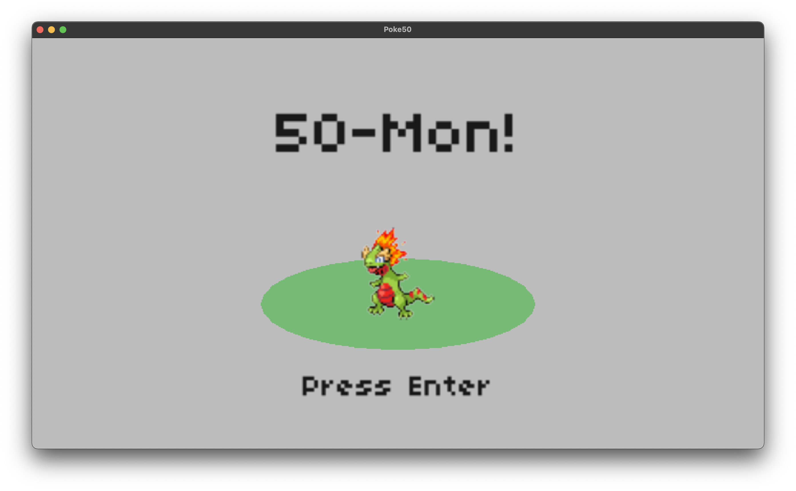

# 50-Mon (Pokemon clone)

Assignment 7 from CS50G

Original code [by Colton Ogden](https://cs50.harvard.edu/games/2018/projects/7/pokemon/)

1. ~~Implement a Menu that appears during the player Pokémon’s level up that shows, for each stat, ‘X + Y = Z’ (for starting, increase, and new total)~~
2. ~~Menu should appear right after the “Level Up” dialogue that appears at the end of a victory~~
3. ~~Menu should not have a cursor.~~

# Playing

Keys:

* *enter*: Close dialog / Select item
* *arrow keys*: Move cursor / Move player
* *escape*: Quit game

# Screenshots

# Credits

Almost all of this code was written [by Colton Ogden](https://cs50.harvard.edu/games/2018/projects/7/pokemon/) for the [CS50G EdX course](https://learning.edx.org/course/course-v1:HarvardX+CS50G+Games/home)
